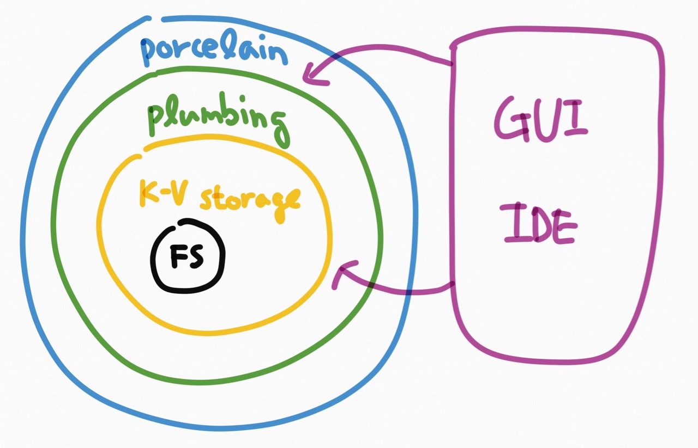

# Git 내부 구조를 알아보자 : 1부 - 저장소 내부 맛보기

안녕하세요, 김대현입니다. Git 내부 구조를 알아보자는 내용으로 글과 스크린캐스트를 찍어 올리고 있습니다. 이 프로젝트의 소개나, 왜 이걸 하는지, 그리고 이게 무엇에 도움이 될지는 이전 글이나 동영상에서 설명한 내용을 참고해 주세요.

* [미디엄 글: Git 내부 구조를 알아보자 (0) 프로젝트 소개와 예고](https://medium.com/happyprogrammer-in-jeju/git-내부-구조를-알아보자-0-프로젝트-소개와-예고-bf3a8549f439)
* [유튜브 동영상: Git 내부 구조를 알아보자 (0) 예고](https://youtu.be/DWnrsbxhuOY)

이번 편, 1부에서는 Git 내부에 저장되는 오브젝트들의 종류와 각각의 저장 형태를 살펴보겠습니다. 저도 공부하며 남기는 내용이므로, 틀린 점이 보이면 지적도 편하게 해주시고, 의견도 남겨주시면, 다음 편에 반영될 수 있습니다. ;-)

## Git 저장소 디렉터리의 내용

아시다시피 Git은 분산 버전 관리 시스템이고, 한 프로젝트의 여러 저장소가 각각 독립적으로 완전한 데이터를 갖고 있을 수 있습니다. 원격 저장소 없이 로컬 저장소만으로도 버전 관리를 할 수도 있지요.

지금부터 로컬에 직접 저장소를 하나 새로 만들어서 진행합니다.

``` bash
$ git --version
$ mkdir 저장소 && cd 저장소
$ git init
$ ls -A
$ ls -p1 .git
HEAD
config
description
hooks/
info/
objects/
refs/
$ tree -a
$ find .
```

이렇게 새로 git 저장소를 만들면, 작업 디렉터리 아래에 `.git/` 디렉터리가 생기고, 이 안에 git 저장소의 모든 내용이 담기게 됩니다. 그리고, 이 내용을 바탕으로, 원격 저장소와 연결하지 않고도, git의 모든 작업을 할 수 있습니다.

지금 막 `git init`로 초기화 해서 뭔가가 있지만, 사실 아직 별다른 내용이 들어 있지 않은 최초 상태입니다. 이제부터 `.git/` 아래에 어떤 내용이 어떻게 들어가는지 알아보겠습니다.

## README.md 파일 추가

방금 만든 빈 저장소에 새로 파일을 하나 추가합니다.

``` bash
$ echo '# 실험용 저장소' > README.md
$ cat README.md
$ git status
$ git add README.md
$ git status
$ tree -a
```

아직 커밋은 하지 않았고, 인덱스 영역에 새로 만든 `README.md`파일이 들어갔습니다. 이 상황에 저장소 디렉터리를 보면, `.git/objects/8a/8363d93e61185f6df18ed61321626be514c7f4` 파일이 새로 생겼다는 점이 눈에 띕니다. 저 암호같은 파일명은 뭘까요?

## Git 기본: SHA-1 해시

Git은 데이터를 저장하기 전에 항상 체크섬을 구하고 그 기준으로 데이터를 관리합니다. 그 체크섬을 구하는데 SHA-1 해시를 사용하고, 그러면 체크섬은 160 bit가 되고, 이를 16진수로 표현하면 40자가 됩니다.

> 8a8363d93e61185f6df18ed61321626be514c7f4

이렇게 말이죠. Git은 모든 것을 해시로 식별해 쓰기에 이런 문자열은 여기저기서 보입니다. 저장소에 보관하는 파일도 이 체크섬을 키로 해서 보관하고, 전체 트리(디렉터리)도 이 체크섬으로 보관하며, 커밋에 대한 데이터도 이 체크섬 기준으로 보관합니다.

이 40자는, 온세상에서 "거의" 유일한 값이 나오므로, 고유키로 쓸 수 있습니다. 그리고 찾고자 하는 범위를 "한 저장소 안"으로 좁히면, 앞의 몇 글자만 써도 대부분 달리 겹치지 않아서, 여덟자나 열자로만 줄여서 쓸 수도 있습니다.

예를 들어, 위 `8a8363d93e61185f6df18ed61321626be514c7f4`을 git 명령어를 쓸 때는 `8a8363`처럼 앞 몇 글자만 적어도 됩니다. GitHub의 경우, 화면에는 앞의 7자만 화면에 보여주고 있습니다. 실제 링크는 40자 전부를 써서 걸려 있습니다.

그래서, 아래 두 명령어는 같은 효과를 냅니다, 우연히 겹치는 두 오브젝트가 있지 않은 이상 말이죠.

``` bash
$ git show 8a8363d93e61185f6df18ed61321626be514c7f4
$ git show 8a8363d
```

이렇게, Git은 내부적으로 SHA1을 써서 데이터를 관리하고, 편의상 그 값의 앞 몇 글자로만 줄여서 지칭하기도 합니다.

## 내용을 주소로 활용 (Content-addressable Key-Value Storage)

"Git은 내용을 주소로 활용하는 파일시스템(content-addressable filesystem)이다"라는 얘기를 들어보셨을 지도 모르겠습니다. Git의 내부는 사실 꽤 단순한(man 페이지에 보면 stupid라는 단어를 쓰고 있습니다) 키-밸류 데이터베이스입니다. 어떤 데이터든 Git에 담을 수 있고, Git은 그 데이터의 SHA1 해시값을 키값으로 해서 저장합니다. 그러면 나중에 다시 그 SHA1 값을 기준으로 보관했던 데이터를 찾을 수 있지요. 이 단순한 키-밸류 스토리지 위에 몇 가지 방식으로 데이터를 담고, 그걸 잘 가져다 활용해서, 결국 겉으로 보기에는 버전 관리 시스템을 쓸 수 있게 됩니다.

구체적으로 말하면, SHA1 해시값을 키로 해서, `.git/objects/` 디렉터리 아래에 마흔자에서 앞 두 자로 디렉토리를 만들고 나머지 서른 여덟자를 파일명으로 해서 특정한 형태로 저장합니다. 아무래도 모든 오브젝트를 한 디렉토리에 다 담으면 불편한 점들이 있으니, 한 단계 디렉토리를 나눠서 256(2^8)개 디렉토리로 나눠 담는 것이죠. 그래서 아까 `git add README.md`로 추가한 내용이 `8a`라는 디렉토리 아래에 생긴 것입니다. 아하~!

## Plumbing & Porcelain

사용자가 Git을 쓰는 명령어는 크게 두 부류로 나뉩니다. 저수준(low-level)의 기본적인 일을 처리하는 plumbing 명령어들과, 고수준(high-level)에서 사용자가 일반적으로 쓰는 porcelain 명령어들이 있습니다. 보통 우리가 Git을 쓸 때는 porcelain 명령어를 쓰고, 그 porcelain 명령어 내부에서 plumbing 명령어들을 활용해서 원하는 일을 처리합니다.

참고로, 두 단어의 각 뜻은 화장실의 "plumbing: 수도 설비, 배관"과 "porcelain: 타일에 쓰이는 자기"라는 뜻인데, 우리가 화장실을 쓸 때는 겉의 타일만 보지만, 실제 복잡한(더러운) 일들은 내부의 배관들이 한다는 식의 비유인 것 같습니다.

이제까지 설명한 레이어들을 아래같은 그림으로 표현할 수 있겠습니다.



이 그림과 함께 다시 설명하자면, git은 각종 OS의 일반 파일시스템 위에 특정 `.git/` 디렉터리에 파일들을 읽고 쓰면서, 이를 키-밸류 스토리지로 활용합니다. git의 키-밸류 스토리지에 직접 접근하는 저수준 명령어를 plumbing 명령어라고 하고, 그 plumbing 명령어들을 써서 사용자에게 유용한 기능을 제공하는 고수준 명령어를 porcelain 명령어라고 합니다.

터미널에서 CLI로 바로 git을 쓰는 분들은 이 porcelain 명령어를 쓰는 것이고, 각종 git GUI이나 IDE에서 git을 쓸 때는, 그 앱들이 porcelain 명령어들을, 그리고 필요에 따라 때로는 plumbing 명령어를 써서 우리에게 버전 관리 기능을 제공하는 것이죠. (사실 GUI나 IDE들은 JGit이나 libgit2같은 라이브러리를 쓰지만, 그 라이브러리들도 plumbing / porcelain API로 나뉘어 있어요)

## 기본 오브젝트

위 그림의 안쪽에 K-V storage 부분에 Git이 내부적으로 저장하는 오브젝트는 일반 파일의 내용을 보관하는 `blob`, 그 `blob`들이 어떤 디렉터리 위치에 어떤 속성과 이름으로 저장되는 지를 나타내는 `tree`, 그리고 매 커밋 순간의 스냅샷을 가리킬 수 있는 `commit` 있습니다.


그리고, 그 `commit`을 가리키는 레퍼런스인 브랜치나 태그, 그리고 현재 작업중인 브랜치의 최종 커밋을 가리키는 `HEAD`가 있지요.

## Blob 추가

BLOB(Binary Large OBject)을 하나 추가해 볼게요. Git이 우리 프로젝트에 필요한 소스 파일, 이미지 파일등의 데이터를 이 blob으로 저장하는데, 파일명 같은 메타데이터(metadata) 없이, 바이너리 데이터 자체만 저장합니다. 저장할 때 사용하는 파일명(키값)은 SHA1 해시값 40 글자이고요.

여기서 `git hash-object`라는 plumbing 명령어를 써서 보여드리는데요, 이는 아까 `git add README.md`로 porcelain 명령어를 썼을 때 내부적으로 활용되는 명령어입니다.

``` bash
$ echo '# 실험용 저장소' > README.md
$ cat README.md | git hash-object --stdin
$ mv .git/objects/8a/8363d93e61185f6df18ed61321626be514c7f4 8a8363.bak
$ cat README.md | git hash-object -w --stdin
$ diff .git/objects/8a/8363d93e61185f6df18ed61321626be514c7f4 8a8363.bak
```

이렇게 `git add`등의 명령어로 파일을 추가할 때, `git hash-object -w`로 그 내용이 `.git/objects` 디렉터리 안에 들어갑니다. 참고로, `git add`는 이렇게 blob을 저장하는 일에 더불어 인덱스 영역에 README.md 파일에 대한 정보가 들어갑니다.

## Blob 파일 내용

이제 Blob이 어떤 파일명으로 어느 디렉토리에 저장되는지는 파악했습니다. 그 안의 내용도 한번 열어보겠습니다.

``` bash
$ cat .git/objects/8a/8363d93e61185f6df18ed61321626be514c7f4
$ file .git/objects/8a/8363d93e61185f6df18ed61321626be514c7f4
```

SHA1 해시값을 디렉터리와 파일명으로 해서 저장한 파일의 내용을 보면, 바이너리 포맷으로 알 수 없는 내용이 담겨있습니다. `file`에게 물어봐도, `VAX COFF executable`라는 엉뚱한 답을 돌려줍니다.

## zlib으로 압축해서 저장

문서에 따르면 `.git/objects/`에 저장하는 파일들은 [zlib](http://www.zlib.net)으로 압축됩니다. 그래서 우선 zlib으로 압축을 풀어야 그 다음 파악을 할 수 있어요. zlib은 무료로 공개된 압축 알고리즘이자 라이브러리로, 라이선스가 자유롭기 때문에 아주 널리 사용됩니다. 각종 프로그래밍 언어의 표준 라이브러리에도 들어있지요. 그런데, 정작 CLI로 압축을 하거나 푸는 프로그램은 마땅치 않네요. 좀 번잡해 보이지만, 루비 스크립트를 써서 zlib 압축을 풀어서 확인해 보겠습니다.

``` bash
$ ruby -rzlib -e 'print Zlib::Inflate.inflate(STDIN.read)' < .git/objects/8a/8363d93e61185f6df18ed61321626be514c7f4
blob 22# 실험용 저장소
$ ruby -rzlib -e 'p Zlib::Inflate.inflate(STDIN.read)' < .git/objects/8a/8363d93e61185f6df18ed61321626be514c7f4
"blob 22\x00# \xEC\x8B\xA4\xED\x97\x98\xEC\x9A\xA9 \xEC\xA0\x80\xEC\x9E\xA5\xEC\x86\x8C\n"
```

번잡한 루비 스크립트가 하는 일은, 단순히 표준입력으로 읽은 내용을 zlib으로 압축 해제하는 것이고, 그 내용을 화면에 찍어보면,

> blob 22#실험용 저장소

라고 보입니다. 확실히 하기 위해, 루비의 `p` 메소드를 썼습니다. 이 메소드는 아스키 문자가 아닌 문자는 코드값으로 보여줍니다.

> "blob 22\x00# \xEC\x8B\xA4\xED\x97\x98\xEC\x9A\xA9 \xEC\xA0\x80\xEC\x9E\xA5\xEC\x86\x8C\n"

화면에 그냥 찍었을 때는 보이지 않던 22뒤에 NULL문자(\x00)가 있습니다. 그 뒷 부분은 원래 파일의 내용이 그대로 들어있습니다.

## 오브젝트 헤더

앞서 본 `blob`처럼, `tree`와 `commit` 오브젝트도 같은 형태의 헤더로 시작하고, 본문은 각 나름의 형태로 저장됩니다. (blob은 단순히 원래 내용이 그대로 담깁니다)

> blob_바이트수\0

각 오브젝트 헤더는, blob / tree / commit등의 문자열로 시작하고, 오브젝트의 타입을 나타냅니다. 그리고 공백문자가 하나 끼어있고, 그 다음에는 헤더를 제외한 본문의 바이트 수를 문자열로 표기합니다. 마지막으로 NULL(\0)문자가 있어서, 헤더의 끝임을 알립니다.

앞서 확인한 오브젝트는 `blob` 타입에 본문은 총 22바이트 길이라는 뜻의 헤더였던 거고, 그 뒤에는 단순히 본문이 그대로 들어있던 것이죠.

별거 없죠?

## 2부에 계속

이상, git 내부에 저장하는 오브젝트들을 간단히 살펴보고, 그 중 blob이 저장되는 형태에 대해 알아봤습니다. 다음편에는 나머지 `tree`와 `commit` 오브젝트도 알아보도록 할게요. 그리고, 레퍼런스에 대해서도 알아봐야겠죠.

아 참, 이번 주말에 하는 [파이콘](https://www.pycon.kr/2016apac/)에 참석합니다. 혹시라도 인연이 닿는 분들은 인사라도 나눌 수 있길 기대합니다. 파이썬의 ㅍ도 모르니 모쪼록 잘 부탁드립니다. 모처럼 상경(!)하는 김에 출장 일정도 잡아 두었기에, 이 연재의 2부는 조금 늦어질 것 같습니다. 그래도, 구독/추천/공유로 널리 알려주시길 바래볼게요, 제발~!
